# The Problem Problem
Scott Jeen

# Agenda

-   What are problems?
-   Identifying problems
    -   *Moral* axioms, lemmas, and propositions
    -   Being the pareto best in the world
-   Checking the problem
    -   Balancing feasiblility and usefulness
    -   Baselines and oracles
-   Takeaways

# What are problems?

## What are problems?

> “A problem is a situation in which we experience conflicting ideas.”
>
> David Deutsch

Let’s start with a definition, here’s the best I’ve found for what
constitutes a problem. David Deautsch says a problem is a situation in
which we experience conflicting ideas. In other words we have two or
more explanations about how we might proceed, and its not initially
clear how to choose between them. This is general; let’s look at what
this means in practice.

## Open problems: this sudoku

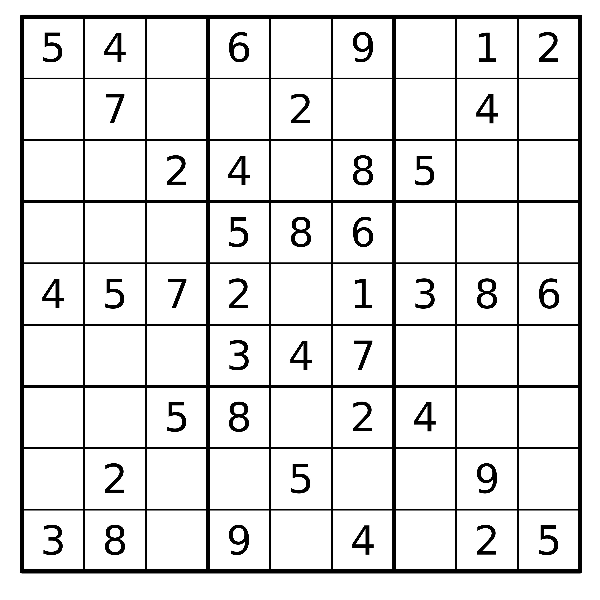

Here’s a problem: this unfinished sudoku. We need a ‘7’ to go somewhere
inside the top-middle box, but as it stands, the 7 could go in multiple
places.

## Open problems: this sudoku

### Idea (a)

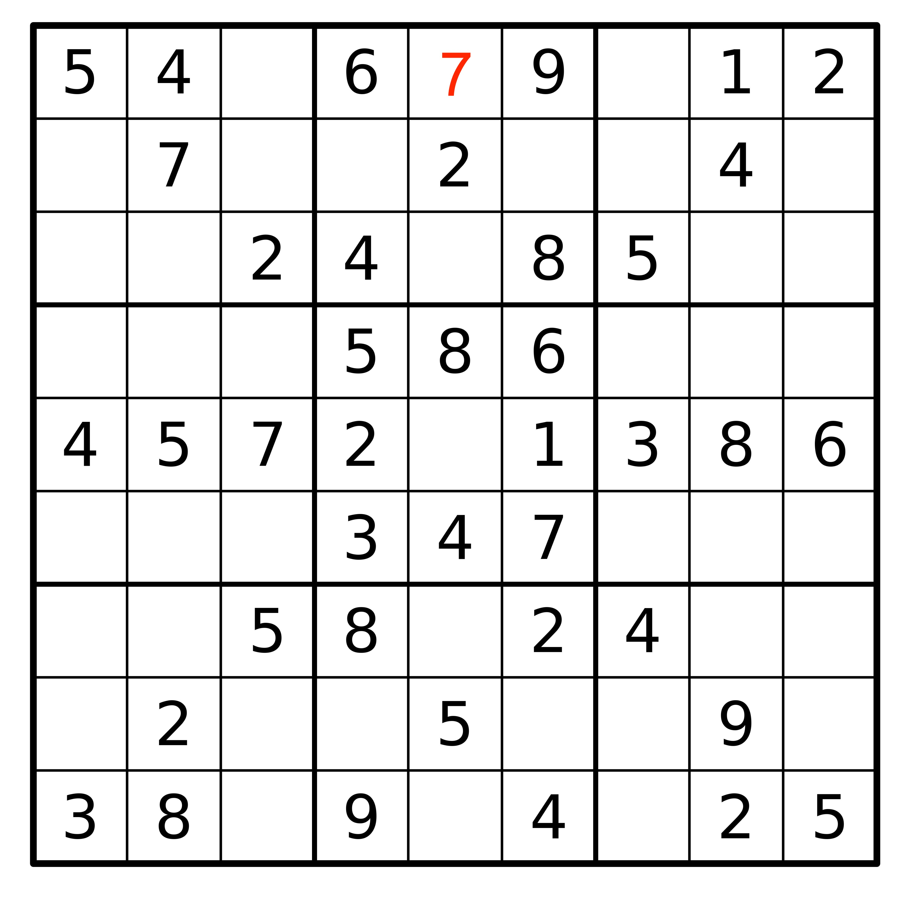

### Idea (b)

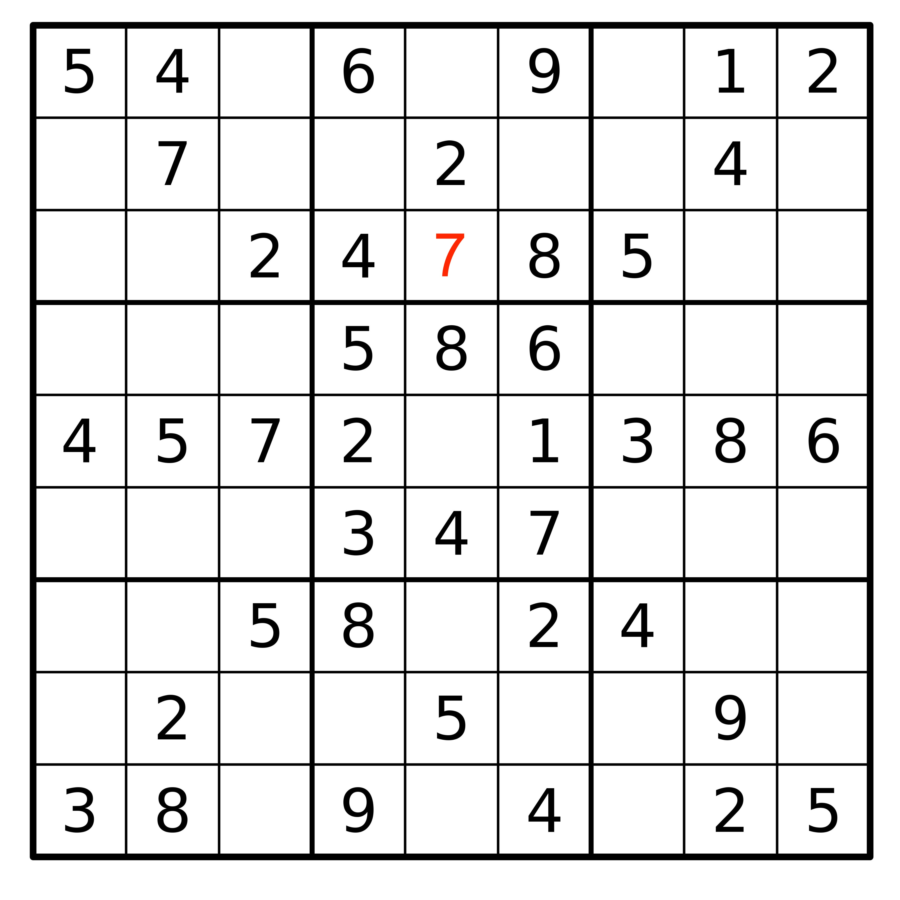

We have multiple ideas about where the 7 could go. A first idea may be
to suggest it goes in the top-middle cell in the box. A second idea may
be to suggest it goes in the bottom-middle cell in the box. As it
stands, we haven’t constrained the problem enough to rule out one of
these options.

## Open problems: the future UK electricity mix

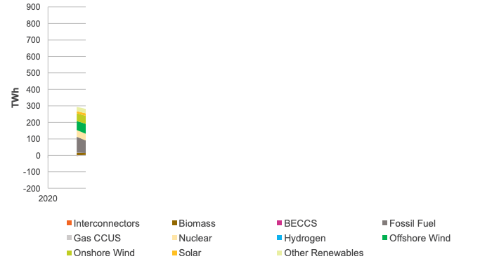

Here’s another open problem: what the future UK electricity mix should
look like to balance, emissions, cost, reliability and security. This
cross-section of the chart summarises the current make-up of the grid:

## Open problems: the future UK electricity mix

### Idea (a)

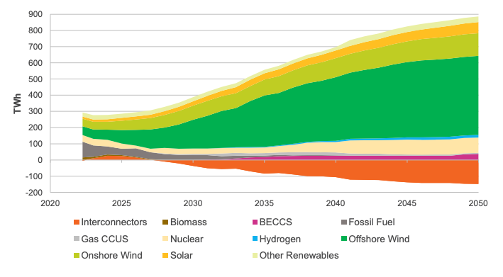

### Idea (b)

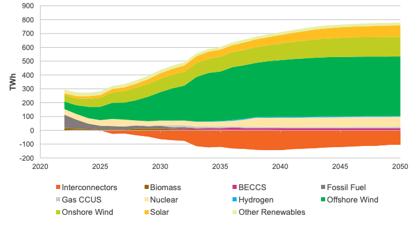

Here are two options from the National Grid’s Future Energy Scenarios
report about what it could look like. Idea a) decarbonises slower, and
then makes up for it with more CCS in future decade. Idea b)
decarbonises quicker and requires less future CCS, but is more costly.
Of course, there are many more ways in which we could conifgure the
future grid mix, and it not clear exactly how we should proceed.

## Open problems: a theory of everything

Here’s one more: a theory of everything; a unification of the four
fundamental forces of physics: electromagnetism, the strong force, the
weak force, and gravity. We have The Standard Model that predicts the
behaviour of the first three; and general relativity for predicting
gravitational effects.

## Open problems: a theory of everything

### Idea (a)

### Idea (b)

An resolution could be string theory (idea (a)), anothe could be
something else.

As these examples imply, solutions to some problems are more important
than others. If you solve the sudoku that, at best, benefits you; if you
come up with a theory of everything that changes humanity’s trajectory.

## Some solutions are better than others

-   To solve a problem we incur a *cost* in exchange for some *gain*  
-   Solutions where cost \>= gain are **zero-sum games**
-   Solutions where gain \> cost are **positive-sum games**

All that is to say: some solutions are better than others. Let’s think
about that more precisely. To solve a problem we incur a cost in
exchange for some gain. Solutions where costs outweigh the gains are
zero-sum games. Solutions where gains outweight the costs are
positive-sum games. Let’s look at some examples.

## Zero-sum games

-   Chess
-   War
-   PhD?

Okay some zero-sum games. Chess is one. In chess, every gain in the
position of Player A is a loss in the position of Player B. And in
general, a win for me delivers a proportional loss for you. Similarly,
war is a zero-sum game. Unfortunately the losses incurred by both sides
of a war (be it financial or human) far outstrip the perceived or real
gains the winner realises. Finally, doing a PhD?

## Positive-sum games

-   Trade
-   Innovation/techology
-   Environmental conservation

Okay some positive-sum games. Trade is the obvious one. For many reasons
countries produce goods at different costs from one another. Take, for
example, the production of citrus fruits like oranges. It’s cheaper to
produce oranges in Spain than it is in the UK because the weather there
is naturally more amendable to it than here. Equally its cheaper to
produce potatatoes in the UK than in Spain for similar reasons. So if we
trade potatoes to Spain in exchange for oranges then both countries get
these items for *less* than we would have if we had produced them
ourselves.

Innovation is a positive-sum game. When an engine is made X% more fuel
efficient, that reduces the fuel bill of everyone who owns that engine
every time the engine is used in the future. When Apple issue a software
update that fixes a bug on iPhones, this benefits everyone who owns an
iphone.

A final positive-sum game is environmental conservation. Mitigating
climate change benefits billions of future humans.

# The goal is to find problems where the solutions are maximally positive-sum

That leads to the first key takeaway of this discussion: the goal should
always be to find problems with solutions that maximally positive sum
i.e. their returns to society far outweight the cost of solving them.
Which leads us to the meat of this discussion.

# Identifying problems

Okay let’s talk about how to identify some of these problems. I’ll talk
about two methods for doing problem identification.

## *Moral* axioms, lemmas and propositions

-   **Moral axioms.** Establish a set of (moral) beliefs that you feel
    cannot be challenged. E.g.
    -   All else being equal, increasing one’s happiness is good.
    -   All else being equal, increasing the average lifespan is good.
    -   All else being equal, increasing our understanding of the
        universe is good.
-   **Lemmas.** Published scientific truths you use as stepping stones
    to connect you to your axiom. E.g.
    -   Happiness is proportional to wealth until a saturation level  
    -   Climate change reduces average lifespans
-   **Propositions.** A problem that, if solved, provides another
    connection to your axiom.

The first uses what I call *moral* axioms, lemmas and propositions. I’m
stealing, a slightly butchering, terms from mathematics here. An axiom
in mathematics is a statement that does not need to be proven, it is
assumed to be true without justification. A lemma, is a previously
established proof that follows from the axiom that is used a stepping
stone to get you to your proposition, which is some mathematical
conjecture that you are about to prove to be true.

Here we going to start with a *moral* axiom, which is a belief about the
world that you feel cannot be challenged. Some examples include,
“increasing one’s happiness is good”, “increasing the average lifespan
is good”, “understanding the universe is good”. Then, we establish a
serious of lemmas, which are published scientific truths you use as
stepping stones to connect you to your axiom. Each lemma should try to
get you as close as possible to maximising the axiom, or resolving the
previous lemma. Eventually if you keep doing this you will run out of
lemmas and you will arrive at a *problem* where there are conflicting
ideas about which stepping stone comes next. You then make a
proposition, which is your what you believe to be the best solution to
the problem. And you prove your proposition with a paper.

## *Moral* axioms, lemmas and propositions

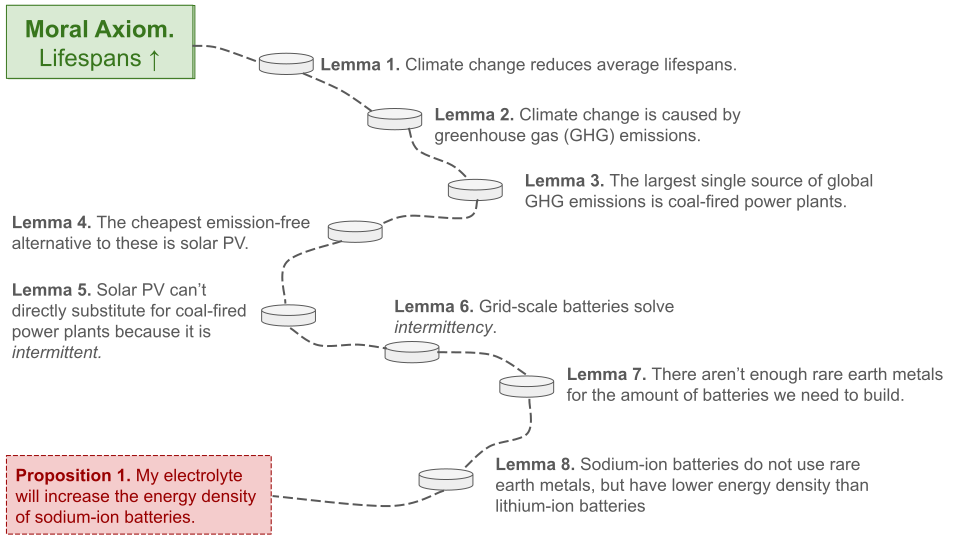

## *Moral* axioms, lemmas and propositions: actions

1.  Think deeply about your moral axioms.
2.  Read widely to establish the chain of science that maximally affects
    your moral axiom.
3.  Establish where the chain of science ends, and propose a way for
    extending the chain i.e. a problem to solve.

So what are the action items from this framework.

## Being the (pareto) best in the world

-   If you are the best in the world at something, you are uniquely
    positioned to see its problems and solve them.
-   Some examples:
    -   Usain Bolt & sprinting
    -   Beyonce & singing
    -   Refficiency & sankey diagrams
-   It is *hard* to be the best in the world at something.
-   But, it is *easy* to be the best in the world at *several things
    simultaneously*.

[Wentsworth, J. “Being the (pareto) best in the world”
(2019)](https://www.lesswrong.com/posts/XvN2QQpKTuEzgkZHY/being-the-pareto-best-in-the-world)

Okay here’s a second method for thinking about problems. It’s called
being the pareto best in the world, and the core idea comes from this
guy John Wentsworth’s blog post.

## Being the (pareto) best in the world

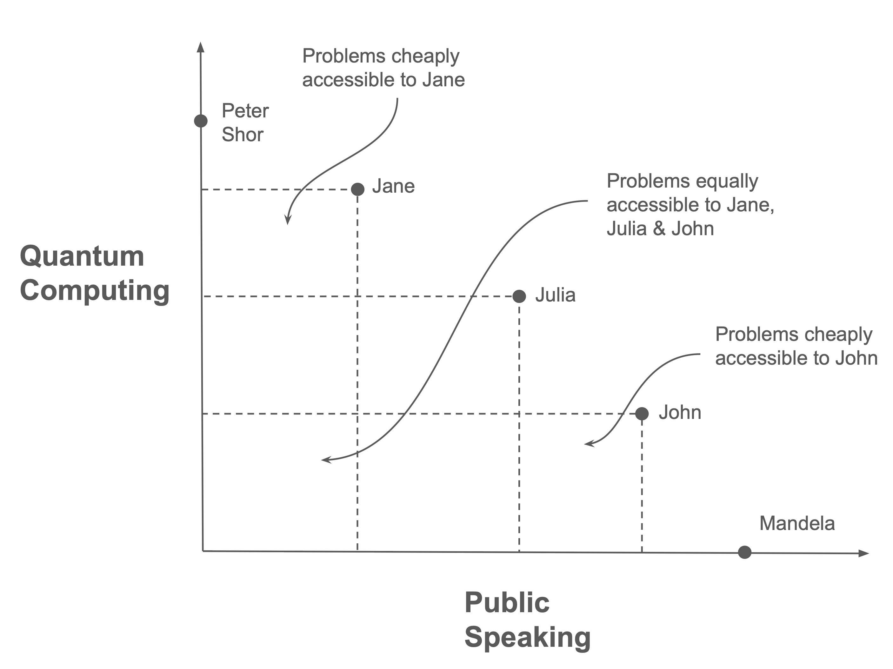

[Wentsworth, J. “Being the (pareto) best in the world”
(2019)](https://www.lesswrong.com/posts/XvN2QQpKTuEzgkZHY/being-the-pareto-best-in-the-world)

Here’s a diagram that plots researchers w.r.t. their statistical skill
and their gerantology knowledge (the study of ageing). If you sit at the
far end of either access you are the best in the world at that skill–so
we have this guy Ed Jaynes as the GOAT bayesian statistician, and at the
top of the y-axis is the GOAT gerantologist. And then we have Alice,
Bob, and Carol are all some combination of the two. Alice is better at
gerontology, and less good at stats, and bob is good at stats and less
good at gerantology. Crucially though, they each have a unique position
on the chart, and that creates areas that require the set of skills only
one them has. The better you are at a combined set of skills, the more
problems are accessible and solvable by you, and you alone. Another way
to think about this is that you have a finite set of tokens you can
spend on improving yourself (in practice this is like time). Let’s say
you have 100 tokens to spend on yourself, the question is what skills
should you exchange your tokens for to maximally increase the number of
problems that are available to you alone. If you are already really good
at gerantology, then a small amount of tokens dedicated to bayesian
stats could make a hugh new set of problems accessible to you.

## Being the (pareto) best in the world: actions

1.  Establish what you are pareto best at today
2.  Use this knowledge to think about the problems that are uniquely
    accessible to you
3.  Think about how you can spend your learning tokens to increase the
    space of problems that are uniquely accessible to you

## Balancing feasiblility and usefulness

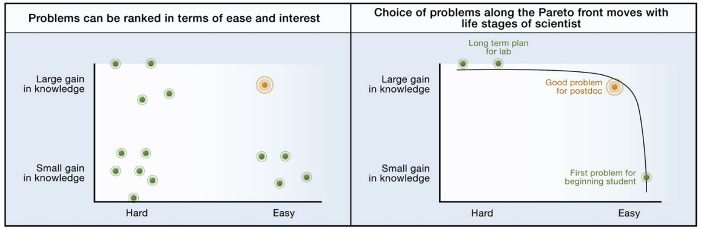

Alon, Uri. “How to choose a good scientific problem.” Molecular cell
35.6 (2009): 726-728.

## Baselines and oracles: is your problem really a problem?

-   Sometimes you can trick yourself into thinking a problem exists when
    it doesn’t. A way to ensure this doesn’t happen is to use
    **Baselines** and **Oracles**
-   A **Baseline** is the current best guess at a solution to the
    problem
-   An **Oracle** is a solution to the problem that relaxes some
    assumptions/constraints
-   For a problem to exist: **there must be a gap between the baseline
    and the oracle**

Nachum, Ofir. [“Baselines and Oracles.”
(2022)](https://ofirnachum.github.io/posts/baselines-and-oracles/)

## Baselines and oracles: is your problem really a problem?

<table>
<colgroup>
<col style="width: 47%" />
<col style="width: 26%" />
<col style="width: 25%" />
</colgroup>
<thead>
<tr class="header">
<th><strong>Problem</strong></th>
<th><strong>Baseline</strong></th>
<th><strong>Oracle</strong></th>
</tr>
</thead>
<tbody>
<tr class="odd">
<td>Solar PV conversion efficiency ☀️</td>
<td>31.25% (Perovskite Tandem Cells)</td>
<td>33.7% (Shockley-Queisser Limit)</td>
</tr>
<tr class="even">
<td>Wind conversion efficiency 💨</td>
<td>~30% (GE Haliade-X)</td>
<td>59.3% (Betz Limit)</td>
</tr>
<tr class="odd">
<td>Building intelligent machines 🤖</td>
<td>GPT-4</td>
<td>Humans</td>
</tr>
<tr class="even">
<td>Unifying the four fundamental forces 🔎</td>
<td>The Standard Model</td>
<td>The Universe</td>
</tr>
</tbody>
</table>

Nachum, Ofir. [“Baselines and Oracles.”
(2022)](https://ofirnachum.github.io/posts/baselines-and-oracles/)

Shockley-queisser limit is the max proportion of energy that can be
extracted from a photon with a p-n junction solar cell. Betz limit is
the theoretical maximum proportion of energy that can be extracting from
a column of fluid.

## Baselines and oracles: is your problem really a problem?

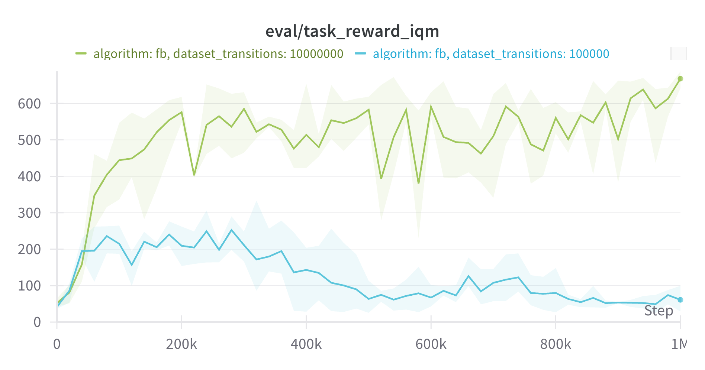

## Baselines and oracles: is your problem really a problem?

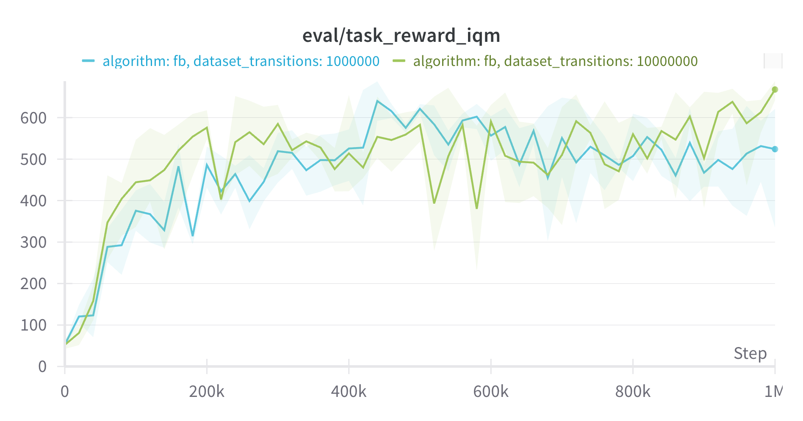

## Baselines and oracles: is your problem really a problem?

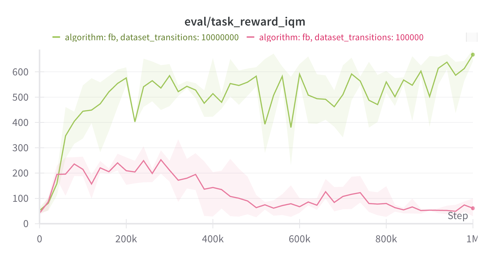

## Baselines and oracles: is your problem really a problem?

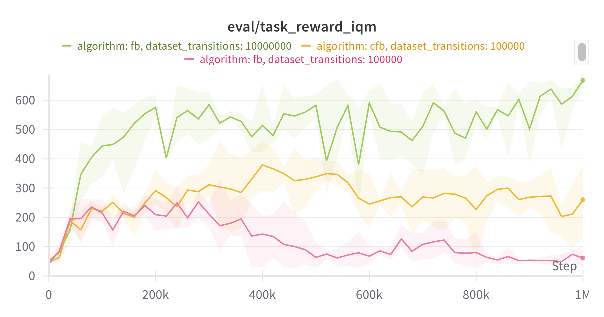

## Baselines and oracles: is your problem really a problem?

A theory:

-   Progress in the hard sciences is fast because physics provides
    oracles
-   Progress in the social sciences is slow because defining oracles is
    difficult (sometimes impossible)

## Checking the problem: actions

-   Think about the problems position on the useful/feasible axis
-   Establish a baseline and an oracle for your problem
    -   If there is no gap between the two, your problem doesn’t exist
    -   The bigger the gap between the two, the better

# Final Takeaways

1.  We want to work on problems that are maximally positive-sum
    i.e. their returns to society are much higher than the costs
2.  Identifying these problems is hard. Some options:
    1.  Moral axioms, lemmas and propositions
    2.  Being the (pareto) best in the world
3.  Once you’ve selected a problem to work on, make sure:
    1.  It is both feasible and useful
    2.  The problem exists (using baselines and oracles)

# Closing remarks

## Progress is incremental

-   “Quantum leaps” do not happen[1]
-   ChatGPT, (arguably) the most surprising technological advance of the
    last 15 years, was a combination small advances made over many
    years  
-   Don’t be intimidated by the “amount of progress” being made
    elsewhere

## Be courageous

> “One of the characteristics of successful scientists is having
> courage. Once you get your courage up and believe that you can do
> important problems, then you can. If you think you can’t, almost
> surely you are not going to.”
>
> Richard Hamming, You and Your Research (1986)

# Thanks!

[1] at least not in the 21st century
